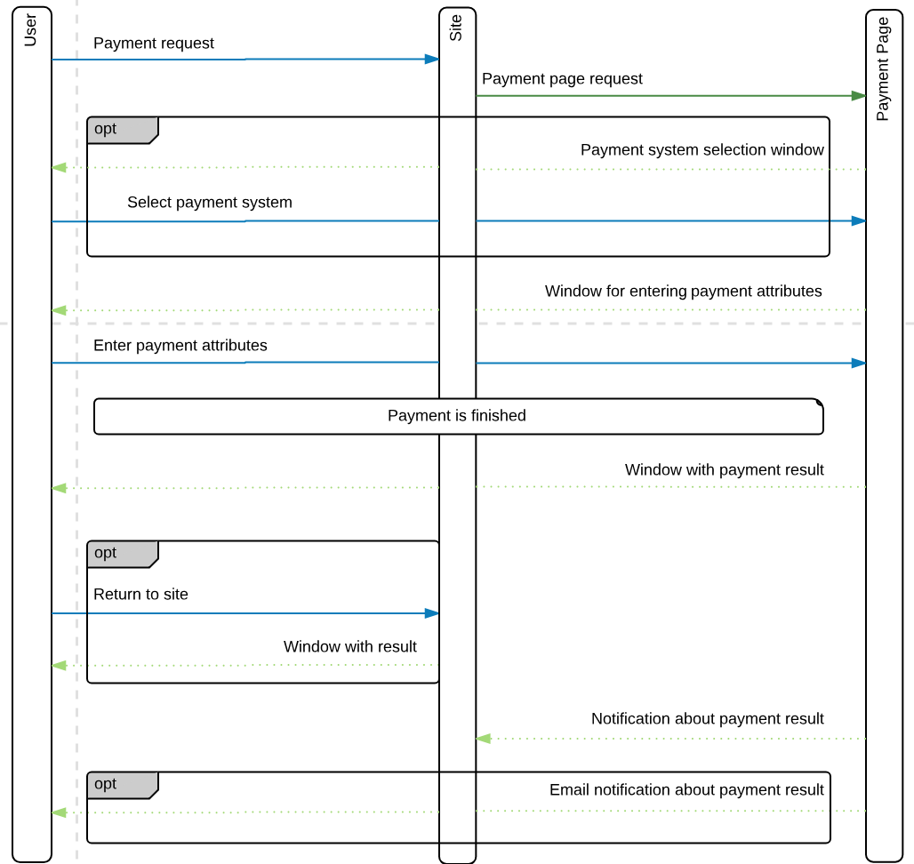

# EcommPay PHP SDK


[](https://coveralls.io/github/ugnku/test_ci?branch=5.6)
[](https://www.codacy.com/gh/ugnku/test_ci/dashboard?utm_source=github.com&amp;utm_medium=referral&amp;utm_content=ugnku/test_ci&amp;utm_campaign=Badge_Grade)


This is a set of libraries in the PHP language to ease integration of your service
with the EcommPay Payment Page.

Please note that for correct SDK operating you must have at least PHP 7.0.  

## Payment flow



## Installation

Install with composer
```bash
composer require ecommpay/paymentpage-sdk
```

### Get URL for payment

```php
$gate = new ecommpay\Gate('secret');
$payment = new ecommpay\Payment('11', 'some payment id');
$payment->setPaymentAmount(1000)->setPaymentCurrency('RUB');
$url = $gate->getPurchasePaymentPageUrl($payment);
``` 

`$url` here is the signed URL.

If you want to use another domain for URL you can change it with optional `Gate` constructor parameter:
```php
new ecommpay\Gate('secret', 'https://mydomain.com/payment');
```
or change it with method 
```php
$gate->setPaymentBaseUrl('https://mydomain.com/payment');
```

### Handle callback from Ecommpay

You'll need to autoload this code in order to handle notifications:

```php
$gate = new ecommpay\Gate('secret');
$callback = $gate->handleCallback($data);
```

`$data` is the JSON data received from payment system;

`$callback` is the Callback object describing properties received from payment system;
`$callback` implements these methods: 
1.  `Callback::getPaymentStatus()` -  Get payment status.
2.  `Callback::getPayment()` - Get all payment data.
3.  `Callback::getPaymentId()` - Get payment ID in your system.
    
### TODO
-   [x] Payment Page opening 
-   [x] Notifications handling
-   [ ] Direct Gate requests
-   [ ] PHPDoc
